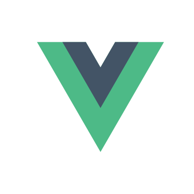

Translations: [Français](./gh-docs/fr/README.md)

<p align="center">
	<a
		href="https://assurance-maladie-digital.github.io/vue-dot/"
		target="_blank"
		rel="noopener noreferrer"
	>
		
	</a>
</p>

<h1 align="center">CNAM – Vue dot</h1>

<p align="center">Official CNAM component library.</p>

<p align="center">
	<a href="https://www.npmjs.com/package/@cnamts/vue-dot">
		
	</a>
	<a href="https://www.npmjs.com/package/@cnamts/vue-dot">
		
	</a>
	<a
		href="https://github.com/assurance-maladie-digital/vue-dot/blob/master/LICENSE">
		
	</a>
</p>

## As Easy as 1, 2, 3

[](https://app.codacy.com/app/Deraw-/vue-dot?utm_source=github.com&utm_medium=referral&utm_content=assurance-maladie-digital/vue-dot&utm_campaign=Badge_Grade_Settings)

### Install

``` bash
yarn add @cnamts/vue-dot # OR npm install @cnamts/vue-dot
```

### Load

```ts
// main.ts
import Vue from 'vue';
import VueDot from '@cnamts/vue-dot';

Vue.use(VueDot);

new Vue({
    render: (h) => h(App)
}).$mount('#app');
```

### You're done! 🎉

``` bash
# run your project
yarn serve # OR your own command
```

It automatically load all components and directives of the library and made them available globally.

## [Documentation](https://assurance-maladie-digital.github.io/vue-dot/)

See [documentation](https://assurance-maladie-digital.github.io/vue-dot/).

## License

VueDot is licensed under a [MIT  License](./LICENSE).
